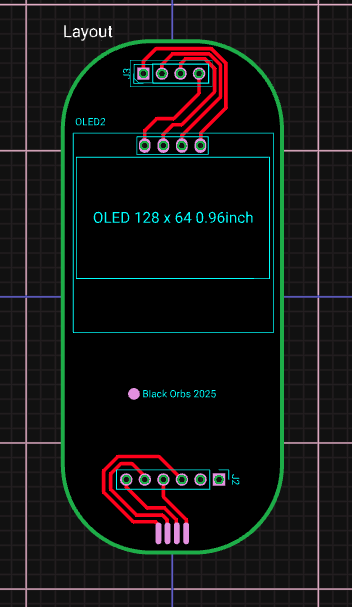
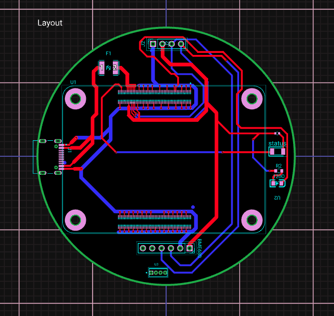

# AIoT Platform for Industrial Environmental Monitoring

Open-source AIoT platform for continuous measurement, storage, visualization, and natural-language interpretation of environmental variables (temperature, humidity, pressure, IAQ) in industrial settings.

> Associated publication: *"AIoT Platform Architecture for Industrial Environmental Monitoring"*  
> Oscar E. Gomez-Morales, Francisco J. Olivera-Guerrero, Leonor A. Cardenas-Robledo  
> Centro de Tecnología Avanzada — CIATEQ A.C., Mexico

---

## System Architecture

```
┌─────────────────────────────────────────────────────────────────┐
│                         EDGE DEVICE                             │
│   ESP32 + SHT85 sensor  →  MQTT publish every 15 min          │
│   Measures: Temperature · Humidity · Pressure · IAQ             │
└────────────────────────┬────────────────────────────────────────┘
                         │ HTTP POST / MQTT
                         ▼
┌─────────────────────────────────────────────────────────────────┐
│                      BACKEND  (backend/)                        │
│   Node.js + Express · MongoDB · Socket.io                       │
│                                                                 │
│   REST endpoints:                                               │
│     POST /data          ← receive sensor readings               │
│     GET  /data          ← last N readings                       │
│     GET  /alerts        ← threshold-triggered alerts           │
│     POST /analyze_openai   ← LLM analysis (GPT-4o)             │
│     POST /analyze_deepseek ← LLM analysis (DeepSeek-chat)      │
│     POST /analyze_mistral  ← LLM analysis (Mistral-medium)     │
│     GET  /ia/history    ← log of all AI interactions            │
│                                                                 │
│   Alert channels: WhatsApp (Twilio) · Telegram · Email         │
└────────────────────────┬────────────────────────────────────────┘
                         │ REST + Socket.io (real-time push)
                         ▼
┌─────────────────────────────────────────────────────────────────┐
│                     FRONTEND  (frontend/)                       │
│   React 19 + Vite · Chart.js · Socket.io-client                 │
│                                                                 │
│   Routes:                                                       │
│     /          → AI assistant (animated eye UI, voice I/O)     │
│     /devices   → Real-time dashboard (T / H / P / IAQ charts)  │
│     /alerts    → Threshold alerts log                           │
│     /history   → Paginated sensor data + CSV export            │
│     /prompts   → AI interaction history                         │
└─────────────────────────────────────────────────────────────────┘
```

---

## Repository Structure

```
aiot_ciateq/
├── frontend/          React + Vite dashboard
├── backend/           Node.js + Express API
│   └── .env.example   Required environment variables
├── simulator/         Software sensor simulator (no hardware needed)
└── hardware/
    ├── images/        PCB renders
    │   ├── carrier_board.png
    │   └── 2nd_pcb.png
    └── gerbers/       Manufacturing files (send to PCB fab)
        └── gmlalo-comblinkiav1-Gerbers-*.zip
```

---

## Hardware — Edge Device

The edge device is a custom PCB carrier board for the **Raspberry Pi CM5** with a **SHT85** environmental sensor. It reads temperature, humidity, barometric pressure, and IAQ (Indoor Air Quality) index, then publishes the data to the backend over HTTP/MQTT.

### PCB

| Top view | Carrier board |
|---|---|
|  |  |

### Bill of Materials (key components)

| Component | Description |
|---|---|
| Raspberry Pi CM5 | Compute Module 5 — edge processing |
| SHT85| Temperature / Humidity / Pressure / IAQ sensor |
| Custom carrier PCB | See `hardware/gerbers/` |

### Manufacturing

The `hardware/gerbers/` folder contains the production-ready Gerber files. Upload the `.zip` directly to any PCB manufacturer (JLCPCB, PCBWay, OSH Park, etc.).

---

## Quick Start

### Prerequisites

- Node.js >= 18
- MongoDB (local or Atlas)
- API keys for at least one LLM provider (OpenAI / DeepSeek / Mistral)

### 1 — Backend

```bash
cd backend
npm install
cp .env.example .env          # fill in your real values
npm run dev                   # starts on port 3001
```

### 2 — Frontend

```bash
cd frontend
npm install
npm run dev                   # starts on http://localhost:5173
```

> The frontend connects to `http://localhost:3001` by default.  
> To change the backend URL, edit `frontend/src/utils/config.js`.

### 3 — Simulator (optional — no hardware required)

If you don't have the physical device, use the simulator to inject synthetic sensor data:

```bash
cd simulator
npm install
node index.js                 # sends a reading every 10 seconds
```

---

## Backend Environment Variables

Copy `backend/.env.example` to `backend/.env` and fill in your credentials.

| Variable | Description |
|---|---|
| `MONGO_URI` | MongoDB connection string |
| `DEVICE_ID` | Unique identifier for your edge device |
| `OPENAI_API_KEY` | OpenAI API key (for GPT-4o analysis) |
| `DEEPSEEK_API_KEY` | DeepSeek API key |
| `MISTRAL_API_KEY` | Mistral API key |
| `TWILIO_*` | Twilio credentials for WhatsApp alerts |
| `TELEGRAM_BOT_TOKEN` | Telegram bot token for alert notifications |
| `TELEGRAM_CHAT_ID` | Telegram chat/group ID to send alerts to |
| `EMAIL_USER / EMAIL_PASS / EMAIL_TO` | SMTP credentials for email alerts |
| `PORT` | HTTP port (default `3001`) |

---

## API Reference

### Sensor Data

| Method | Endpoint | Body | Description |
|--------|----------|------|-------------|
| `POST` | `/data` | `{temperature, humidity, pressure, iaq}` | Ingest a sensor reading |
| `GET` | `/data` | — | Retrieve last 100 readings (newest first) |

### Alerts

| Method | Endpoint | Description |
|--------|----------|-------------|
| `GET` | `/alerts` | List all threshold alerts |
| `POST` | `/alert/whatsapp` | Trigger WhatsApp alert |
| `POST` | `/alert/telegram` | Trigger Telegram alert |
| `POST` | `/alert/email` | Trigger email alert |

### AI Analysis

| Method | Endpoint | Body | Description |
|--------|----------|------|-------------|
| `POST` | `/analyze_openai` | `{customPrompt?}` | Analyze recent data with GPT-4o |
| `POST` | `/analyze_deepseek` | `{customPrompt?}` | Analyze with DeepSeek-chat |
| `POST` | `/analyze_mistral` | `{customPrompt?}` | Analyze with Mistral-medium |
| `GET` | `/ia/history` | — | Retrieve all past AI interactions |

If `customPrompt` is omitted, the backend builds an automatic analysis prompt from the last 100 readings.

---

## Dashboard Features

| Feature | Description |
|---|---|
| Real-time cards | Latest T / H / P / IAQ values, updated via Socket.io |
| Time-series charts | Scrollable trend lines for all four variables |
| Alerts table | Threshold violations with severity level and location |
| Sensor history | Paginated table with date filter and one-click CSV export |
| AI assistant | Natural-language chat with GPT-4o / DeepSeek / Mistral; supports voice input and text-to-speech output |
| AI history | Full log of every prompt sent and response received |

---

## Tech Stack

| Layer | Technology |
|---|---|
| Edge firmware | MicroPython / Arduino (ESP32 or CM5) |
| Backend | Node.js · Express 5 · MongoDB (Mongoose) · Socket.io |
| AI providers | OpenAI GPT-4o · DeepSeek-chat · Mistral-medium |
| Alert channels | Twilio (WhatsApp) · Telegram Bot API · Nodemailer (SMTP) |
| Frontend | React 19 · Vite · Chart.js · react-router-dom v7 |
| Hardware | Raspberry Pi CM5 · SHT85 · Custom PCB |

---

## License

MIT — see [LICENSE](LICENSE) for details.

---

*Built at CIATEQ A.C. — Centro de Tecnología Avanzada, Mexico.*
